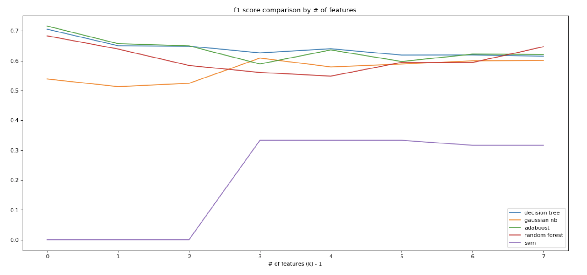
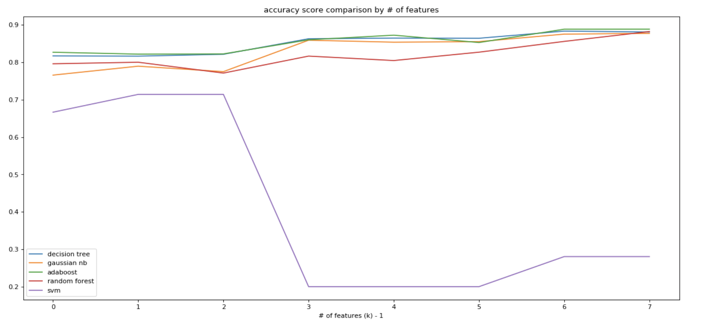

# Data Analysis and Machine Learning on Enron Dataset

This notebook shows how data analysis on enron dataset can be done. The goal of the analysis is to find the best machine learning algorithm with the best precision and recal metric values. Each algorithms' job on the way is to correctly classify poi(person of interest) from the dataset. POIs are who I am interested in since I think they are strongly related to [Enron Scandal](https://en.wikipedia.org/wiki/Enron_scandal). POIs are chosen mannually and provided by Udacity's "[Intro to Machine Learning](https://www.udacity.com/course/intro-to-machine-learning--ud120)" course. You can think of this notebook as a part of the assignment for the final project from the course.

# The way it is organized

1. Choose features of my interest
2. Perform basic data analysis
3. Find outliers, and remove them when needed
4. Perform various machine learning algorithms
5. Compare each results
6. Confirm the best result

# Machine Learning Part

1. Perform basic DecisionTree classifier on raw data
2. Perform basic DecisionTree classifier on data that outliers are removed
3. Define a function to measure accuracy, precision, and recall metrics
4. Define a function to run Pipeline with SelectKBest, and GridSearchCV
5. Run different kinds of ML algorithms with a number of different parameters
 - Decision Tree Classifier
 - Adaboost Classifier
 - Random Forest Classifier
 - Support Vector Machine Classifier
 - Gaussian Naive Bayse Classifier

# Result

 F1 Score Result 

  

 Accuracy Score Result 

# Conclusion
The best model I could find is 'Adaboost'. The parameters with the below, it did the best job.

- feature list: 'poi', 'bonus'
- algotirthm: 'SAMME.R'
- learning rate: 0.05
- number of estimators: 30

And the scores are

- accuracy: 0.827
- f1: 0.7159

This model achieved the best f1 score comparing to other models, DecisionTree, Gaussian Naive Bayes, Random Forest, and Support Vector Machine. While having the best f1 score, the number of feature used is only 2. I think it could mean this model is not overfitted much. Furthermore, it achieved the best accuracy as well in the group of other models under the same number of features.

# Reference
conceptual study
- https://www.udacity.com

programming reference
- https://pandas.pydata.org
- http://scikit-learn.org/stable/

error reference
- https://stackoverflow.com/questions/30442259/why-does-not-gridsearchcv-give-best-score-scikit-learn
- https://stackoverflow.com/questions/25222123/why-are-the-grid-scores-higher-than-the-score-for-full-training-set-sklearn?rq=1
- https://stackoverflow.com/questions/26097921/choosing-random-state-for-sklearn-algorithms
- https://stackoverflow.com/questions/28064634/random-state-pseudo-random-numberin-scikit-learn
